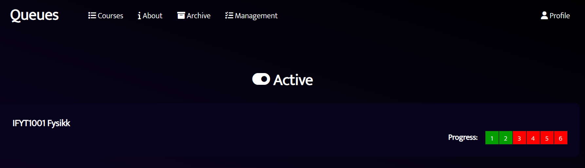

# Queues

## Description
Voluntary project in our Fullstack course. Our task was to build a website for assignment-approval in a school setting. Teachers can register courses and create users for its students, where the students can get in queue for getting an assignment approved by a teacher or a teaching assistant.
The developers for this project are:
- Markus Solli Pedersen, markussp@stud.ntnu.no
- Nicolay Caspersen Roness, nicolayr@stud.ntnu.no
- Leonard Opsal Taklo, leonaro@stud.ntnu.no

## Visuals

## Installation 
Host a MySQL server with address 'localhost:3306' with a schema with name 'qs', user 'root', and password 'password'.  
The backend runs on Spring Boot with Maven, we prefer opening the project in IntelliJ and clicking the 'Run QueuesApplication' button.  
The frontend is built on vue, so open src/frontend and run 'npm run serve' to host the website on port 8080.

## Usage
The server has a role policy that requires an Admin to start with, by visiting localhost:3000/example an admin with username 'roger@roger.no' and password 'roger' gets created.  
The Admin has full access to the website, and is able to create courses and new users. Newly created users gets an e-mail with an activation link to set their password.  
Teachers can manage courses that they are assigned to by the admin. New students, rooms and assignments can be added to a course.  
Student assistants can approve assignments for other students by going into a courses queue page, and picking a student in line.  
A Student can place themselves in a courses queue when its opened, and get their assignments approved. On the course page they also get a status on how many assignments they have approved in each course.  

## Documentation
Documentation of the project architecture can be found in the Project_Architecture.pdf-file in the root folder.
The server has been well documented with Javadoc, and the html can be found at JavaDoc/index.html in the root folder.
Documentation for all server endpoints can be found when visiting the url localhost:3000/swagger-ui/index.html (when the server is running).

## Libraries
This project makes use of some great external libraries: 

### Frontend:
- For api requests, we use [axios](https://www.npmjs.com/package/axios)
- For fonts, we use [FontAwesome](https://fontawesome.com/)
- For token decoding in the frontend, we use [jwt-decode](https://www.npmjs.com/package/jwt-decode)
- For mapping the location of rooms, we use [MazeMap API](https://www.mazemap.com/solutions/developer-apis)

### Backend:
- For api endpoint documentation, we use [Springdoc with Swagger-ui](https://springdoc.org/)
- For token generation in the backend, we use [this JWT token Library](https://github.com/jwtk/jjwt)
